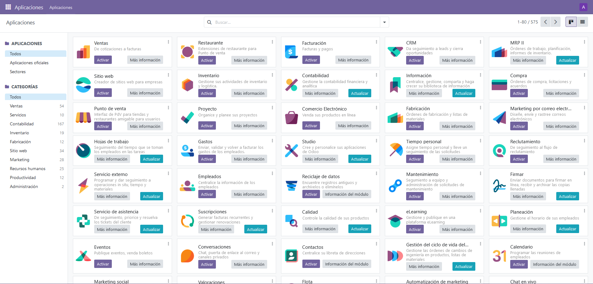

# Odoo Instalación

## Configuración de Docker Compose

El archivo `docker-compose.yml` contiene la configuración de los servicios de PostgreSQL y Odoo.

### Servicios

```
version: '3'
services:
  db:
    image: postgres:latest
    environment:
      POSTGRES_DB: postgres
      POSTGRES_USER: odoo
      POSTGRES_PASSWORD: odoo
    ports:
      - "5432:5432"
    volumes:
      - db_data:/var/lib/postgresql/data

  odoo:
    image: odoo:latest
    depends_on:
      - db
    ports:
      - "8069:8069"
    volumes:
      - ./addons:/mnt/extra-addons


```

### Volumes

```
volumes:
  db_data:
  odoo_data:
```

### Configuración de PostgreSQL (`db` service)

- `image: postgres:latest`: Este servicio utiliza la imagen Docker oficial de PostgreSQL en su última versión disponible.

- `environment`: Define variables de entorno para configurar la base de datos PostgreSQL:
  - `POSTGRES_DB`: El nombre de la base de datos que se creará.
  - `POSTGRES_USER`: El nombre de usuario para acceder a la base de datos.
  - `POSTGRES_PASSWORD`: La contraseña del usuario de la base de datos.

- `ports`: Mapea el puerto `5432` del contenedor PostgreSQL al puerto `5432` del host, lo que permite acceder a la base de datos PostgreSQL desde el exterior.

- `volumes`: Define un volumen persistente para almacenar los datos de PostgreSQL en el host, garantizando que los datos no se pierdan incluso si el contenedor se detiene o elimina.

### Configuración de Odoo (`odoo` service)

- `image: odoo:latest`: Este servicio utiliza la imagen Docker oficial de Odoo en su última versión disponible.

- `depends_on`: Define que este servicio depende del servicio `db` (PostgreSQL). Esto asegura que el contenedor de Odoo se inicie después de que el contenedor de PostgreSQL esté en funcionamiento.

- `ports`: Mapea el puerto `8069` del contenedor Odoo al puerto `8069` del host, lo que permite acceder a la interfaz web de Odoo desde el exterior.

- `volumes`: Monta un volumen local en el contenedor Odoo, permitiendo la persistencia de los addons personalizados en la carpeta `addons/`.

### Volumenes

- `db_data`: Este volumen almacena los datos persistentes de PostgreSQL en el host.

- `odoo_data`: Aunque este volumen está definido, no se utiliza en la configuración actual. Podría ser útil para almacenar datos persistentes de Odoo si fuera necesario en futuras iteraciones del proyecto.


## Ejecución de los Contenedores


```
docker-compose up -d
```

Esto iniciará los servicios de PostgreSQL y Odoo en segundo plano.

## Enlace de PyCharm con Docker y PostgreSQL

Para enlazar PyCharm con Docker y la base de datos PostgreSQL, sigue los siguientes pasos:

1. **Instala el plugin de Docker en PyCharm.**
2. Abre PyCharm y ve a Configuración de Ejecución (Run/Debug Configurations).
3. Configura una nueva ejecución de Docker para tu proyecto.
4. Configura una nueva conexión a la base de datos PostgreSQL dentro de PyCharm utilizando las credenciales definidas en el archivo `docker-compose.yml`.

## ¿Qué hacer si el puerto 5432 está ocupado?

Si el puerto `5432` está ocupado en tu ordenador local, puedes solucionarlo modificando el mapeo de puertos en el archivo `docker-compose.yml`. Cambia el puerto del servicio PostgreSQL en el host a uno disponible en tu máquina.

Después de hacer la configuración definida antes, desde el navegor abrimos odoo (localhost:8069) y nos debería aparecer en pantalla esta imagen.


Rellenaremos todos los campos con los datos que nosotros queramos nos pedirá el mail y contraseña y por fin tendremos Odoo en nuestro navegador para empezar a trabajar.


